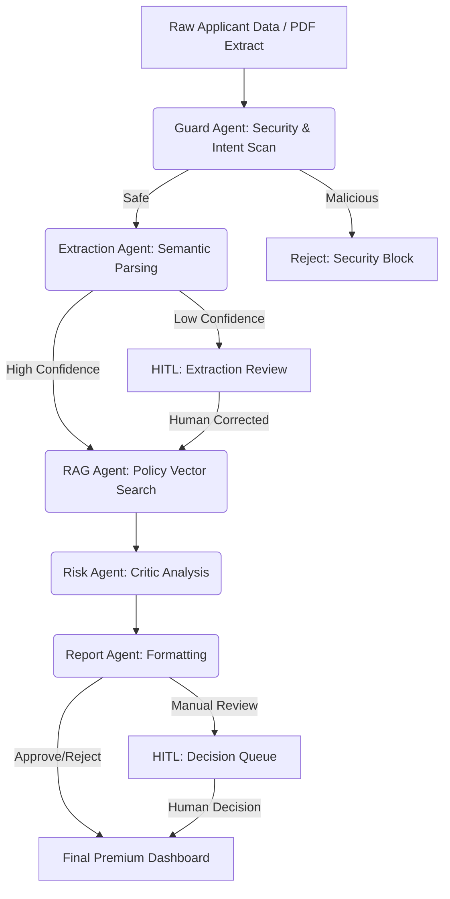

# 🏦 Agentic Underwriting Copilot

A next-generation, multi-agent AI framework for automated credit underwriting, real-time risk analysis, and Human-in-the-Loop (HITL) compliance validation. Built with **LangGraph**, **FastAPI**, and a Premium Modular Vanilla JS frontend.

---

## 🏗️ System Architecture (Multi-Agent DAG)

The core engine is orchestrated as a stateful Directed Acyclic Graph (DAG) using LangGraph. Each node represents a highly specialized AI agent performing a discrete underwriting task.



---

## 🧮 Mathematical Foundations

The underwriting pipeline relies on deterministic financial ratios, probabilistic threat vectors, and high-dimensional semantic clustering. 

### 1. Financial Ratio Constraints
The primary heuristic for risk is the **Debt-to-Income (DTI)** ratio. The Risk Agent deterministically calculates this constraint before applying LLM heuristic analysis.

$$ 
\text{DTI} = \frac{\sum_{i=1}^{n} \text{Debt}_i}{\text{Monthly Gross Income}} 
$$

Where $\text{Debt}_i$ represents individual monthly liabilities (e.g., mortgages, auto loans, revolving credit facilities). Corporate policy mandates that the threshold $\tau_{DTI} \leq 0.43$ for strict automated approvals.

### 2. Malicious Intent Scoring
The Guard Agent utilizes a fast-inference evaluation to probabilistically score the unstructured input $x$ for prompt injection, adversarial jailbreak attempts, or instructions aiming to manipulate the application state. The malicious probability is bounded by a sigmoid distribution:

$$ 
\mathcal{P}(\text{Malicious} \mid x) = \sigma(W^T \phi(x) + b) \in [0, 1]
$$

If $\mathcal{P} > 0.70$, the pipeline halts immediately, triggering a Terminal State transition to a `Security Block` to protect the isolated enterprise environment.

### 3. High-Dimensional Policy Retrieval (XAI Vector Space)
To ensure the LLM's final credit decisions are deeply grounded in real corporate policy, the RAG Agent algorithm projects both the applicant's extracted financial profile vector $\mathbf{q}$ and the chunked, disjoint policy documents $\mathbf{d}_i$ into a dense vector subspace using `all-MiniLM-L6-v2`.

Similarity in the mathematical vector space is derived using Cosine Similarity:

$$ 
\text{sim}(\mathbf{q}, \mathbf{d}_i) = \frac{\mathbf{q} \cdot \mathbf{d}_i}{||\mathbf{q}|| \cdot ||\mathbf{d}_i||} 
$$

The system retrieves the top-$k$ nearest neighbor policy clusters to dynamically aggregate the context window $\mathcal{C}$:

$$ 
\mathcal{C} = \bigcup_{j=1}^{k} \arg\max_{\mathbf{d} \in D} \left( \text{sim}(\mathbf{q}, \mathbf{d}) \right) 
$$

This logic guarantees that the final generating Critic Agent strictly conditions its inference on $P(y \mid x, \mathcal{C})$, which massively reduces the bounds of hallucination variance.

---

## 💻 Tech Stack
- **AI Core**: LangGraph, LangChain, FAISS VectorDB
- **LLM Inferencing**: Meta Llama-3-70B & 8B (Served via Groq API)
- **Embeddings**: HuggingFace `all-MiniLM-L6-v2`
- **Backend Architecture**: Python 3.10+, FastAPI, Uvicorn
- **Frontend / XAI UI**: Vanilla HTML/JS/CSS (Premium Dashboard, Chart.js Visualizations)

---

## 🚀 Getting Started

1. **Clone the Environment**
   ```bash
   git clone https://github.com/itsom-ops/credit_copilot.git
   cd credit_copilot
   ```

2. **Initialize Python Backend**
   ```bash
   python -m venv venv
   .\venv\Scripts\activate
   pip install -r requirements.txt
   ```

3. **Configure Telemetry**
   Add your designated highly-performant inference API Key to a `.env` file at the root:
   ```env
   GROQ_API_KEY=gsk_your_key_here
   ```

4. **Ignite the Server**
   ```bash
   python main.py
   ```

5. **Interact**
   Open your browser and navigate to `http://127.0.0.1:8001/` to log into the operational dashboard.
